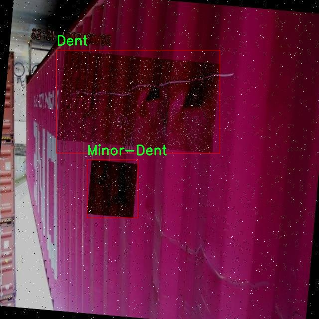
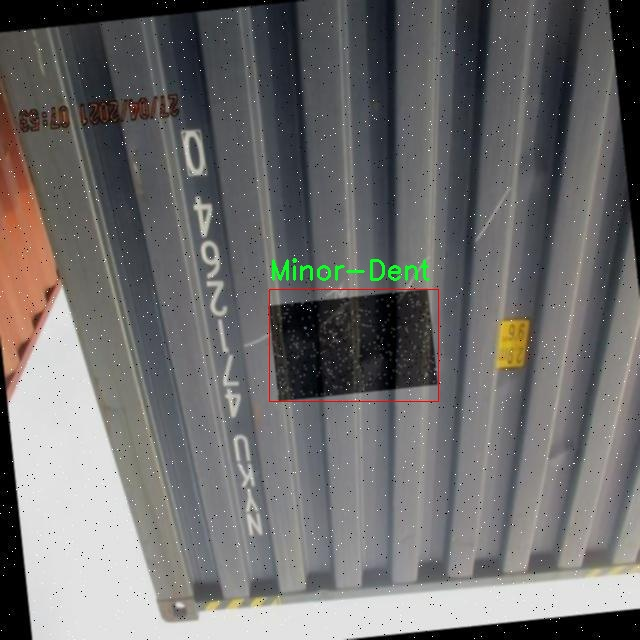

# 改进yolo11-CloAtt等200+全套创新点大全：集装箱损伤检测系统源码＆数据集全套

### 1.图片效果展示


##### 项目来源 **[人工智能促进会 2024.10.24](https://kdocs.cn/l/cszuIiCKVNis)**

注意：由于项目一直在更新迭代，上面“1.图片效果展示”和“2.视频效果展示”展示的系统图片或者视频可能为老版本，新版本在老版本的基础上升级如下：（实际效果以升级的新版本为准）

  （1）适配了YOLOV11的“目标检测”模型和“实例分割”模型，通过加载相应的权重（.pt）文件即可自适应加载模型。

  （2）支持“图片识别”、“视频识别”、“摄像头实时识别”三种识别模式。

  （3）支持“图片识别”、“视频识别”、“摄像头实时识别”三种识别结果保存导出，解决手动导出（容易卡顿出现爆内存）存在的问题，识别完自动保存结果并导出到tempDir中。

  （4）支持Web前端系统中的标题、背景图等自定义修改。

  另外本项目提供训练的数据集和训练教程,暂不提供权重文件（best.pt）,需要您按照教程进行训练后实现图片演示和Web前端界面演示的效果。

### 2.视频效果展示

[2.1 视频效果展示](https://www.bilibili.com/video/BV1BX1YY1ExG/)

### 3.背景

研究背景与意义

随着全球贸易的迅速发展，集装箱作为国际运输的重要载体，其安全性和完整性直接影响到货物的运输效率和经济效益。然而，集装箱在长途运输过程中，常常遭遇各种损伤，如变形、凹陷、孔洞、轻微凹陷及锈蚀等，这些损伤不仅影响集装箱的使用寿命，还可能导致货物的损坏和运输事故。因此，及时、准确地检测集装箱损伤成为保障运输安全的重要环节。

传统的集装箱损伤检测方法主要依赖人工检查，效率低下且容易受到人为因素的影响，难以满足现代物流行业对快速、精准检测的需求。近年来，计算机视觉技术的迅猛发展为集装箱损伤检测提供了新的解决方案。特别是基于深度学习的目标检测模型，如YOLO（You Only Look Once），因其高效的实时检测能力而受到广泛关注。YOLOv11作为YOLO系列的最新版本，具备更强的特征提取能力和更快的推理速度，适合应用于集装箱损伤检测任务。

本研究旨在基于改进的YOLOv11模型，构建一个高效的集装箱损伤检测系统。我们将使用包含1300张图像的数据集，涵盖了五种损伤类别：变形、凹陷、孔洞、轻微凹陷和锈蚀。通过对这些数据的深入分析与处理，结合YOLOv11的优势，我们期望能够实现对集装箱损伤的快速、准确检测，从而提升集装箱的管理效率，降低运输风险。此外，本研究还将为相关领域的研究提供参考，推动智能检测技术在物流行业的应用，具有重要的理论意义和实际价值。

### 4.数据集信息展示

##### 4.1 本项目数据集详细数据（类别数＆类别名）

nc: 5
names: ['Deframe', 'Dent', 'Hole', 'Minor-Dent', 'Rust']


该项目为【目标检测】数据集，请在【训练教程和Web端加载模型教程（第三步）】这一步的时候按照【目标检测】部分的教程来训练

##### 4.2 本项目数据集信息介绍

本项目数据集信息介绍

本项目所使用的数据集名为“Container Damage Detection”，旨在为改进YOLOv11的集装箱损伤检测系统提供高质量的训练数据。该数据集专注于集装箱的多种损伤类型，涵盖了五个主要类别，分别为“Deframe”（框架损坏）、“Dent”（凹陷）、“Hole”（孔洞）、“Minor-Dent”（轻微凹陷）和“Rust”（锈蚀）。这些类别的选择基于集装箱在实际使用过程中常见的损伤类型，旨在帮助系统更准确地识别和分类不同程度的损伤，从而提高检测的准确性和效率。

数据集中包含大量的标注图像，这些图像经过精心挑选，确保涵盖了各种环境和条件下的集装箱损伤实例。每个类别的样本数量均衡，确保模型在训练过程中能够获得充分的学习机会，减少因类别不平衡而导致的偏差。此外，数据集中的图像来源多样，包括不同类型和颜色的集装箱，进一步增强了模型的泛化能力，使其能够在实际应用中更好地适应不同的场景。

在数据预处理阶段，所有图像均经过标准化处理，以确保输入数据的一致性。同时，标注信息采用了高精度的边界框和分类标签，确保模型能够在训练过程中准确学习到损伤特征。通过使用“Container Damage Detection”数据集，改进后的YOLOv11模型将能够在集装箱损伤检测任务中实现更高的检测率和更低的误报率，为集装箱运输和管理行业提供更为可靠的技术支持。








### 5.全套项目环境部署视频教程（零基础手把手教学）

[5.1 所需软件PyCharm和Anaconda安装教程（第一步）](https://www.bilibili.com/video/BV1BoC1YCEKi/?spm_id_from=333.999.0.0&vd_source=bc9aec86d164b67a7004b996143742dc)


[5.2 安装Python虚拟环境创建和依赖库安装视频教程（第二步）](https://www.bilibili.com/video/BV1ZoC1YCEBw?spm_id_from=333.788.videopod.sections&vd_source=bc9aec86d164b67a7004b996143742dc)

### 6.改进YOLOv11训练教程和Web_UI前端加载模型教程（零基础手把手教学）

[6.1 改进YOLOv11训练教程和Web_UI前端加载模型教程（第三步）](https://www.bilibili.com/video/BV1BoC1YCEhR?spm_id_from=333.788.videopod.sections&vd_source=bc9aec86d164b67a7004b996143742dc)


按照上面的训练视频教程链接加载项目提供的数据集，运行train.py即可开始训练



     Epoch   gpu_mem       box       obj       cls    labels  img_size
     1/200     20.8G   0.01576   0.01955  0.007536        22      1280: 100%|██████████| 849/849 [14:42<00:00,  1.04s/it]
               Class     Images     Labels          P          R     mAP@.5 mAP@.5:.95: 100%|██████████| 213/213 [01:14<00:00,  2.87it/s]
                 all       3395      17314      0.994      0.957      0.0957      0.0843

     Epoch   gpu_mem       box       obj       cls    labels  img_size
     2/200     20.8G   0.01578   0.01923  0.007006        22      1280: 100%|██████████| 849/849 [14:44<00:00,  1.04s/it]
               Class     Images     Labels          P          R     mAP@.5 mAP@.5:.95: 100%|██████████| 213/213 [01:12<00:00,  2.95it/s]
                 all       3395      17314      0.996      0.956      0.0957      0.0845

     Epoch   gpu_mem       box       obj       cls    labels  img_size
     3/200     20.8G   0.01561    0.0191  0.006895        27      1280: 100%|██████████| 849/849 [10:56<00:00,  1.29it/s]
               Class     Images     Labels          P          R     mAP@.5 mAP@.5:.95: 100%|███████   | 187/213 [00:52<00:00,  4.04it/s]
                 all       3395      17314      0.996      0.957      0.0957      0.0845


###### [项目数据集下载链接](https://kdocs.cn/l/cszuIiCKVNis)

### 7.原始YOLOv11算法讲解


ultralytics发布了最新的作品YOLOv11，这一次YOLOv11的变化相对于ultralytics公司的上一代作品YOLOv8变化不是很大的（YOLOv9、YOLOv10均不是ultralytics公司作品），其中改变的位置涉及到C2f变为C3K2，在SPPF后面加了一层类似于注意力机制的C2PSA，还有一个变化大家从yaml文件是看不出来的就是它的检测头内部替换了两个DWConv，以及模型的深度和宽度参数进行了大幅度调整，但是在损失函数方面就没有变化还是采用的CIoU作为边界框回归损失，下面带大家深入理解一下ultralytics最新作品YOLOv11的创新点。

**下图为最近的YOLO系列发布时间线！**


* * *

###### YOLOv11和YOLOv8对比

在YOLOYOLOv5，YOLOv8，和YOLOv11是ultralytics公司作品（ultralytics出品必属精品），下面用一张图片从yaml文件来带大家对比一下YOLOv8和YOLOv11的区别，配置文件变得内容比较少大家可以看一卡，左侧为YOLOv8右侧为YOLOv11，不同的点我用黑线标注了出来。


* * *

###### YOLOv11的网络结构解析

下面的图片为YOLOv11的网络结构图。


**其中主要创新点可以总结如下- > **

* * *

1\.
提出C3k2机制，其中C3k2有参数为c3k，其中在网络的浅层c3k设置为False（下图中可以看到c3k2第二个参数被设置为False，就是对应的c3k参数）。


此时所谓的C3k2就相当于YOLOv8中的C2f，其网络结构为一致的，其中的C3k机制的网络结构图如下图所示
**（为什么叫C3k2，我个人理解是因为C3k的调用时C3k其中的参数N固定设置为2的原因，个人理解不一定对** ）。


* * *

2\.
第二个创新点是提出C2PSA机制，这是一个C2（C2f的前身）机制内部嵌入了一个多头注意力机制，在这个过程中我还发现作者尝试了C2fPSA机制但是估计效果不如C2PSA，有的时候机制有没有效果理论上真的很难解释通，下图为C2PSA机制的原理图，仔细观察把Attention哪里去掉则C2PSA机制就变为了C2所以我上面说C2PSA就是C2里面嵌入了一个PSA机制。


* * *

3\.
第三个创新点可以说是原先的解耦头中的分类检测头增加了两个DWConv，具体的对比大家可以看下面两个图下面的是YOLOv11的解耦头，上面的是YOLOv8的解耦头.


我们上面看到了在分类检测头中YOLOv11插入了两个DWConv这样的做法可以大幅度减少参数量和计算量（原先两个普通的Conv大家要注意到卷积和是由3变为了1的，这是形成了两个深度可分离Conv），大家可能不太理解为什么加入了两个DWConv还能够减少计算量，以及什么是深度可分离Conv，下面我来解释一下。

> **`DWConv` 代表 Depthwise
> Convolution（深度卷积）**，是一种在卷积神经网络中常用的高效卷积操作。它主要用于减少计算复杂度和参数量，尤其在移动端或轻量化网络（如
> MobileNet）中十分常见。
>
> **1\. 标准卷积的计算过程**
>
> 在标准卷积操作中，对于一个输入张量（通常是一个多通道的特征图），卷积核的尺寸是 `(h, w, C_in)`，其中 `h` 和 `w`
> 是卷积核的空间尺寸，`C_in`
> 是输入通道的数量。而卷积核与输入张量做的是完整的卷积运算，每个输出通道都与所有输入通道相连并参与卷积操作，导致计算量比较大。
>
> 标准卷积的计算过程是这样的：
>
>   * 每个输出通道是所有输入通道的组合（加权求和），卷积核在每个位置都会计算与所有输入通道的点积。
>   * 假设有 `C_in` 个输入通道和 `C_out` 个输出通道，那么卷积核的总参数量是 `C_in * C_out * h * w`。
>

>
> 2\. **Depthwise Convolution（DWConv）**
>
> 与标准卷积不同， **深度卷积** 将输入的每个通道单独处理，即 **每个通道都有自己的卷积核进行卷积**
> ，不与其他通道进行交互。它可以被看作是标准卷积的一部分，专注于空间维度上的卷积运算。
>
> **深度卷积的计算过程：**
>
>   * 假设输入张量有 `C_in` 个通道，每个通道会使用一个 `h × w`
> 的卷积核进行卷积操作。这个过程称为“深度卷积”，因为每个通道独立进行卷积运算。
>   * 输出的通道数与输入通道数一致，每个输出通道只和对应的输入通道进行卷积，没有跨通道的组合。
>   * 参数量和计算量相比标准卷积大大减少，卷积核的参数量是 `C_in * h * w`。
>

>
> **深度卷积的优点：**
>
>   1. **计算效率高** ：相对于标准卷积，深度卷积显著减少了计算量。它只处理空间维度上的卷积，不再处理通道间的卷积。
>   2.  **参数量减少** ：由于每个卷积核只对单个通道进行卷积，参数量大幅减少。例如，标准卷积的参数量为 `C_in * C_out * h *
> w`，而深度卷积的参数量为 `C_in * h * w`。
>   3.  **结合点卷积可提升效果** ：为了弥补深度卷积缺乏跨通道信息整合的问题，通常深度卷积后会配合 `1x1` 的点卷积（Pointwise
> Convolution）使用，通过 `1x1` 的卷积核整合跨通道的信息。这种组合被称为 **深度可分离卷积** （Depthwise
> Separable Convolution） | **这也是我们本文YOLOv11中的做法** 。
>

>
> 3\. **深度卷积与标准卷积的区别**
>
> 操作类型| 卷积核大小| 输入通道数| 输出通道数| 参数量  
> ---|---|---|---|---  
> 标准卷积| `h × w`| `C_in`| `C_out`| `C_in * C_out * h * w`  
> 深度卷积（DWConv）| `h × w`| `C_in`| `C_in`| `C_in * h * w`  
>  
> 可以看出，深度卷积在相同的卷积核大小下，参数量减少了约 `C_out` 倍
> （细心的人可以发现用最新版本的ultralytics仓库运行YOLOv8参数量相比于之前的YOLOv8以及大幅度减少了这就是因为检测头改了的原因但是名字还是Detect，所以如果你想继续用YOLOv8发表论文做实验那么不要更新最近的ultralytics仓库）。
>
> **4\. 深度可分离卷积 (Depthwise Separable Convolution)**
>
> 深度卷积常与 `1x1` 的点卷积配合使用，这称为深度可分离卷积。其过程如下：
>
>   1. 先对输入张量进行深度卷积，对每个通道独立进行空间卷积。
>   2. 然后通过 `1x1` 点卷积，对通道维度进行混合，整合不同通道的信息。
>

>
> 这样既可以保证计算量的减少，又可以保持跨通道的信息流动。
>
> 5\. **总结**
>
> `DWConv` 是一种高效的卷积方式，通过单独处理每个通道来减少计算量，结合 `1x1`
> 的点卷积，形成深度可分离卷积，可以在保持网络性能的同时极大地减少模型的计算复杂度和参数量。

**看到这里大家应该明白了为什么加入了两个DWConv还能减少参数量以及YOLOv11的检测头创新点在哪里。**

* * *

##### YOLOv11和YOLOv8还有一个不同的点就是其各个版本的模型（N - S - M- L - X）网络深度和宽度变了


可以看到在深度（depth）和宽度
（width）两个地方YOLOv8和YOLOv11是基本上完全不同了，这里我理解这么做的含义就是模型网络变小了，所以需要加深一些模型的放缩倍数来弥补模型之前丧失的能力从而来达到一个平衡。

> **本章总结：**
> YOLOv11的改进点其实并不多更多的都是一些小的结构上的创新，相对于之前的YOLOv5到YOLOv8的创新，其实YOLOv11的创新点不算多，但是其是ultralytics公司的出品，同时ultralytics仓库的使用量是非常多的（不像YOLOv9和YOLOv10）所以在未来的很长一段时间内其实YOLO系列估计不会再更新了，YOLOv11作为最新的SOTA肯定是十分适合大家来发表论文和创新的。
>

### 8.200+种全套改进YOLOV11创新点原理讲解

#### 8.1 200+种全套改进YOLOV11创新点原理讲解大全

由于篇幅限制，每个创新点的具体原理讲解就不全部展开，具体见下列网址中的改进模块对应项目的技术原理博客网址【Blog】（创新点均为模块化搭建，原理适配YOLOv5~YOLOv11等各种版本）

[改进模块技术原理博客【Blog】网址链接](https://gitee.com/qunmasj/good)


#### 8.2 精选部分改进YOLOV11创新点原理讲解

###### 这里节选部分改进创新点展开原理讲解(完整的改进原理见上图和[改进模块技术原理博客链接](https://gitee.com/qunmasj/good)【如果此小节的图加载失败可以通过CSDN或者Github搜索该博客的标题访问原始博客，原始博客图片显示正常】


### 空间和通道重建卷积SCConv
参考该博客提出的一种高效的卷积模块，称为SCConv (spatial and channel reconstruction convolution)，以减少冗余计算并促进代表性特征的学习。提出的SCConv由空间重构单元(SRU)和信道重构单元(CRU)两个单元组成。

（1）SRU根据权重分离冗余特征并进行重构，以抑制空间维度上的冗余，增强特征的表征。

（2）CRU采用分裂变换和融合策略来减少信道维度的冗余以及计算成本和存储。

（3）SCConv是一种即插即用的架构单元，可直接用于替代各种卷积神经网络中的标准卷积。实验结果表明，scconvo嵌入模型能够通过减少冗余特征来获得更好的性能，并且显著降低了复杂度和计算成本。


SCConv如图所示，它由两个单元组成，空间重建单元(SRU)和通道重建单元(CRU)，以顺序的方式放置。具体而言，对于瓶颈残差块中的中间输入特征X，首先通过SRU运算获得空间细化特征Xw，然后利用CRU运算获得信道细化特征Y。SCConv模块充分利用了特征之间的空间冗余和通道冗余，可以无缝集成到任何CNN架构中，以减少中间特征映射之间的冗余并增强CNN的特征表示。

#### SRU单元用于空间冗余


为了利用特征的空间冗余，引入了空间重构单元(SRU)，如图2所示，它利用了分离和重构操作。

分离操作 的目的是将信息丰富的特征图与空间内容对应的信息较少的特征图分离开来。我们利用组归一化(GN)层中的比例因子来评估不同特征图的信息内容。具体来说，给定一个中间特征映射X∈R N×C×H×W，首先通过减去平均值µ并除以标准差σ来标准化输入特征X，如下所示:


其中µ和σ是X的均值和标准差，ε是为了除法稳定性而加入的一个小的正常数，γ和β是可训练的仿射变换。

GN层中的可训练参数\gamma \in R^{C}用于测量每个批次和通道的空间像素方差。更丰富的空间信息反映了空间像素的更多变化，从而导致更大的γ。归一化相关权重W_{\gamma} \in R^{C}由下面公式2得到，表示不同特征映射的重要性。


然后将经Wγ重新加权的特征映射的权值通过sigmoid函数映射到(0,1)范围，并通过阈值进行门控。我们将阈值以上的权重设置为1，得到信息权重W1，将其设置为0，得到非信息权重W2(实验中阈值设置为0.5)。获取W的整个过程可以用公式表示。


最后将输入特征X分别乘以W1和W2，得到两个加权特征:信息量较大的特征X_{1}^{\omega }和信息量较小的特征X_{2}^{\omega }。这样就成功地将输入特征分为两部分:X_{1}^{\omega }具有信息量和表达性的空间内容，而X_{2}^{\omega }几乎没有信息，被认为是冗余的。

重构操作 将信息丰富的特征与信息较少的特征相加，生成信息更丰富的特征，从而节省空间空间。采用交叉重构运算，将加权后的两个不同的信息特征充分结合起来，加强它们之间的信息流。然后将交叉重构的特征X^{\omega1}和X^{\omega2}进行拼接，得到空间精细特征映射X^{\omega}。从后过程表示如下：


其中⊗是逐元素的乘法，⊕是逐元素的求和，∪是串联。将SRU应用于中间输入特征X后，不仅将信息特征与信息较少的特征分离，而且对其进行重构，增强代表性特征，抑制空间维度上的冗余特征。然而，空间精细特征映射X^{\omega}在通道维度上仍然是冗余的。

#### CRU单元用于通道冗余


分割 操作将输入的空间细化特征X^{\omega}分割成两个部分，一部分通道数是\alpha C，另一部分通道数是(1-\alpha) C，随后对两组特征的通道数使用1 * 1卷积核进行压缩，分别得到X_{up}和X_{low}。

转换 操作将输入的X_{up}作为“富特征提取”的输入，分别进行GWC和PWC，然后相加得到输出Y1，将输入X_{low}作为“富特征提取”的补充，进行PWC，得到的记过和原来的输入取并集得到Y2。

融合 操作使用简化的SKNet方法来自适应合并Y1和Y2。具体说是首先使用全局平均池化将全局空间信息和通道统计信息结合起来，得到经过池化的S1和S2。然后对S1和S2做Softmax得到特征权重向量\beta _{1}和\beta _{2}，最后使用特征权重向量得到输出Y = \beta _{1}*Y_{1} + \beta _{2}*Y_{2}，Y即为通道提炼的特征。


### 9.系统功能展示

图9.1.系统支持检测结果表格显示

  图9.2.系统支持置信度和IOU阈值手动调节

  图9.3.系统支持自定义加载权重文件best.pt(需要你通过步骤5中训练获得)

  图9.4.系统支持摄像头实时识别

  图9.5.系统支持图片识别

  图9.6.系统支持视频识别

  图9.7.系统支持识别结果文件自动保存

  图9.8.系统支持Excel导出检测结果数据


### 10. YOLOv11核心改进源码讲解

#### 10.1 rep_block.py

以下是经过简化和注释的核心代码部分，主要保留了 `DiverseBranchBlock` 类及其相关的核心功能。

```python
import torch
import torch.nn as nn
import torch.nn.functional as F

def transI_fusebn(kernel, bn):
    """
    将卷积核和批归一化层的参数融合，返回融合后的卷积核和偏置。
    """
    gamma = bn.weight  # 获取缩放因子
    std = (bn.running_var + bn.eps).sqrt()  # 计算标准差
    return kernel * ((gamma / std).reshape(-1, 1, 1, 1)), bn.bias - bn.running_mean * gamma / std

def conv_bn(in_channels, out_channels, kernel_size, stride=1, padding=0, dilation=1, groups=1):
    """
    创建一个包含卷积层和批归一化层的顺序容器。
    """
    conv_layer = nn.Conv2d(in_channels=in_channels, out_channels=out_channels, kernel_size=kernel_size,
                           stride=stride, padding=padding, dilation=dilation, groups=groups,
                           bias=False)
    bn_layer = nn.BatchNorm2d(num_features=out_channels, affine=True)
    return nn.Sequential(conv_layer, bn_layer)

class DiverseBranchBlock(nn.Module):
    def __init__(self, in_channels, out_channels, kernel_size, stride=1, padding=None, dilation=1, groups=1):
        super(DiverseBranchBlock, self).__init__()

        # 设置填充
        if padding is None:
            padding = kernel_size // 2  # 默认填充为核大小的一半

        # 定义主卷积层和批归一化层
        self.dbb_origin = conv_bn(in_channels=in_channels, out_channels=out_channels, kernel_size=kernel_size,
                                  stride=stride, padding=padding, dilation=dilation, groups=groups)

        # 定义1x1卷积层
        self.dbb_1x1 = conv_bn(in_channels=in_channels, out_channels=out_channels, kernel_size=1, stride=stride,
                               padding=0, groups=groups)

        # 定义平均池化层
        self.dbb_avg = nn.Sequential(
            nn.AvgPool2d(kernel_size=kernel_size, stride=stride, padding=padding),
            nn.BatchNorm2d(out_channels)
        )

    def get_equivalent_kernel_bias(self):
        """
        获取等效的卷积核和偏置，用于推理阶段。
        """
        k_origin, b_origin = transI_fusebn(self.dbb_origin[0].weight, self.dbb_origin[1])
        k_1x1, b_1x1 = transI_fusebn(self.dbb_1x1[0].weight, self.dbb_1x1[1])
        k_avg, b_avg = transI_fusebn(self.dbb_avg[1].weight, self.dbb_avg[1])

        # 返回融合后的卷积核和偏置
        return k_origin + k_1x1 + k_avg, b_origin + b_1x1 + b_avg

    def forward(self, inputs):
        """
        前向传播函数。
        """
        out = self.dbb_origin(inputs)  # 主卷积输出
        out += self.dbb_1x1(inputs)    # 加上1x1卷积输出
        out += self.dbb_avg(inputs)     # 加上平均池化输出
        return out  # 返回最终输出
```

### 代码说明
1. **`transI_fusebn`**: 该函数用于将卷积层的权重与其后面的批归一化层的参数融合，返回融合后的卷积核和偏置。

2. **`conv_bn`**: 该函数创建一个包含卷积层和批归一化层的顺序容器，方便后续使用。

3. **`DiverseBranchBlock`**: 这是一个主要的神经网络模块，包含多个分支（主卷积、1x1卷积和平均池化）。它在初始化时设置了各个层，并在前向传播时计算输出。

4. **`get_equivalent_kernel_bias`**: 该方法用于获取推理阶段所需的等效卷积核和偏置，确保在部署时的计算效率。

5. **`forward`**: 该方法定义了模块的前向传播逻辑，计算并返回最终的输出。

该文件 `rep_block.py` 定义了一些用于构建深度学习模型的模块，主要集中在多分支卷积块的实现上。代码中使用了 PyTorch 框架，包含了多个类和函数，主要用于实现不同类型的卷积层和处理过程。

首先，文件导入了必要的库，包括 `torch` 和 `torch.nn`，以及一些自定义的模块。接着，定义了一些用于卷积和批归一化的转换函数。这些函数的作用是将卷积核和批归一化层的参数进行融合，以便在模型推理时减少计算量和提高效率。

接下来，定义了多个类，分别实现了不同的卷积块。`IdentityBasedConv1x1` 类实现了一个基于身份映射的 1x1 卷积层，该层在卷积操作中保持输入特征图的部分信息。`BNAndPadLayer` 类则实现了一个结合了批归一化和填充的层，能够在进行批归一化后对输出进行适当的填充。

`DiverseBranchBlock` 类是该文件的核心部分，它实现了一个多分支卷积块，包含多个不同的卷积路径。这些路径可以通过不同的卷积核和操作来提取特征，最后将这些特征相加以获得最终的输出。该类支持在训练和推理阶段的不同操作模式，可以通过 `switch_to_deploy` 方法将训练时的参数转换为推理时的参数。

此外，`DiverseBranchBlockNOAct` 和 `DeepDiverseBranchBlock` 类分别实现了没有激活函数的多分支卷积块和深度多分支卷积块。`WideDiverseBranchBlock` 类则扩展了多分支卷积块的功能，增加了对非对称卷积的支持，通过在卷积过程中结合水平和垂直卷积来增强特征提取能力。

这些类的设计考虑了不同的输入通道、输出通道、卷积核大小、步幅、填充等参数，提供了灵活的配置选项，以适应不同的网络架构需求。通过这些模块，用户可以方便地构建复杂的卷积神经网络，以实现更高效的特征提取和分类任务。

#### 10.2 head.py

以下是经过简化和注释的核心代码部分，主要集中在 `Detect_DyHead` 类及其相关方法上。这个类是 YOLOv8 检测模型的一个重要组成部分，负责生成预测的边界框和类别概率。

```python
import torch
import torch.nn as nn
import math

class Detect_DyHead(nn.Module):
    """YOLOv8 检测头，使用动态头进行目标检测。"""
    
    def __init__(self, nc=80, hidc=256, block_num=2, ch=()):
        """
        初始化检测头的参数。
        
        参数:
        nc (int): 类别数量，默认为 80。
        hidc (int): 隐藏层通道数，默认为 256。
        block_num (int): 动态头的块数量，默认为 2。
        ch (tuple): 输入通道数的元组。
        """
        super().__init__()
        self.nc = nc  # 类别数量
        self.nl = len(ch)  # 检测层数量
        self.reg_max = 16  # DFL 通道数
        self.no = nc + self.reg_max * 4  # 每个锚点的输出数量
        self.stride = torch.zeros(self.nl)  # 构建时计算的步幅
        c2, c3 = max((16, ch[0] // 4, self.reg_max * 4)), max(ch[0], self.nc)  # 通道数

        # 定义卷积层
        self.conv = nn.ModuleList(nn.Sequential(Conv(x, hidc, 1)) for x in ch)
        self.dyhead = nn.Sequential(*[DyHeadBlock(hidc) for _ in range(block_num)])  # 动态头块
        self.cv2 = nn.ModuleList(
            nn.Sequential(Conv(hidc, c2, 3), Conv(c2, c2, 3), nn.Conv2d(c2, 4 * self.reg_max, 1)) for _ in ch
        )
        self.cv3 = nn.ModuleList(
            nn.Sequential(
                nn.Sequential(DWConv(hidc, x, 3), Conv(x, c3, 1)),
                nn.Sequential(DWConv(c3, c3, 3), Conv(c3, c3, 1)),
                nn.Conv2d(c3, self.nc, 1),
            )
            for x in ch
        )
        self.dfl = DFL(self.reg_max) if self.reg_max > 1 else nn.Identity()  # DFL 层

    def forward(self, x):
        """前向传播，返回预测的边界框和类别概率。"""
        for i in range(self.nl):
            x[i] = self.conv[i](x[i])  # 通过卷积层处理输入
        x = self.dyhead(x)  # 通过动态头处理
        shape = x[0].shape  # 获取输出形状
        for i in range(self.nl):
            # 将 cv2 和 cv3 的输出连接在一起
            x[i] = torch.cat((self.cv2[i](x[i]), self.cv3[i](x[i])), 1)
        
        # 训练模式下直接返回
        if self.training:
            return x
        
        # 动态模式或形状变化时更新锚点和步幅
        self.anchors, self.strides = (x.transpose(0, 1) for x in make_anchors(x, self.stride, 0.5))
        self.shape = shape

        # 将输出展平并分割为边界框和类别
        x_cat = torch.cat([xi.view(shape[0], self.no, -1) for xi in x], 2)
        box, cls = x_cat.split((self.reg_max * 4, self.nc), 1)  # 分割为边界框和类别
        dbox = dist2bbox(self.dfl(box), self.anchors.unsqueeze(0), xywh=True, dim=1) * self.strides  # 解码边界框
        y = torch.cat((dbox, cls.sigmoid()), 1)  # 返回边界框和类别概率
        return y

    def bias_init(self):
        """初始化检测头的偏置，要求有步幅信息。"""
        for a, b, s in zip(self.cv2, self.cv3, self.stride):
            a[-1].bias.data[:] = 1.0  # 边界框偏置初始化为 1.0
            b[-1].bias.data[:self.nc] = math.log(5 / self.nc / (640 / s) ** 2)  # 类别偏置初始化
```

### 代码说明：
1. **类定义**：`Detect_DyHead` 是 YOLOv8 检测模型的一个类，继承自 `nn.Module`。
2. **初始化方法**：`__init__` 方法中定义了模型的参数，包括类别数量、隐藏层通道数、动态头块数量等，并初始化了各个卷积层。
3. **前向传播**：`forward` 方法处理输入数据，生成预测的边界框和类别概率。根据训练模式的不同，返回不同的输出。
4. **偏置初始化**：`bias_init` 方法用于初始化模型的偏置参数，确保模型在训练开始时具有合理的偏置值。

这个类是 YOLOv8 检测模型的核心部分，负责将输入特征图转换为目标检测的输出。

这个 `head.py` 文件是一个用于 YOLOv8 目标检测模型的实现，主要包含多个检测头（Detect Head）的定义。这些检测头用于处理不同的任务，如目标检测、分割、姿态估计等。文件中使用了 PyTorch 框架，并定义了一系列的类和方法来实现这些功能。

首先，文件导入了一些必要的库，包括数学库、深度学习库（如 PyTorch）、以及一些自定义模块和函数。这些导入的模块和函数提供了卷积、深度可分离卷积、动态卷积等功能，帮助构建复杂的神经网络结构。

文件中定义了多个检测头类，每个类都继承自 `nn.Module`，并实现了 `__init__` 和 `forward` 方法。`__init__` 方法用于初始化模型的参数和层，而 `forward` 方法则定义了前向传播的过程。

- `Detect_DyHead` 类是一个动态头，用于目标检测，支持动态网格重建。它包含多个卷积层和动态头块（DyHeadBlock），用于提取特征并生成边界框和类别概率。
- `Detect_AFPN_P345` 和 `Detect_AFPN_P2345` 类实现了自适应特征金字塔网络（AFPN），用于增强特征提取能力。
- `Detect_Efficient` 类则是一个高效的检测头，采用轻量级设计以提高推理速度。
- `DetectAux` 类实现了辅助检测头，能够在主检测头的基础上进行额外的预测。
- `Detect_LSCD` 和 `Detect_LSCSBD` 类则实现了轻量级共享卷积检测头，旨在减少模型的参数量和计算量。
- `Detect_TADDH` 类实现了任务动态对齐检测头，结合了任务分解和动态卷积的思想，以提高检测精度。

每个检测头的 `forward` 方法都负责处理输入特征图，进行卷积操作，生成预测的边界框和类别概率。在推理阶段，模型会根据输入的特征图动态生成锚框，并计算最终的输出。

此外，文件中还定义了一些辅助类，如 `Scale` 和 `Conv_GN`，用于实现可学习的缩放参数和标准卷积操作，分别用于增强模型的灵活性和性能。

总的来说，这个文件通过定义多个检测头和相关的辅助类，构建了一个灵活且高效的目标检测框架，适用于不同的应用场景。

#### 10.3 test_selective_scan_speed.py

以下是代码中最核心的部分，并附上详细的中文注释：

```python
import torch
import torch.nn.functional as F

def build_selective_scan_fn(selective_scan_cuda: object = None, mode="mamba_ssm", tag=None):
    """
    构建选择性扫描函数的工厂函数。
    
    参数:
    selective_scan_cuda: CUDA实现的选择性扫描函数。
    mode: 选择性扫描的模式。
    tag: 标签，用于标识函数。
    
    返回:
    selective_scan_fn: 构建的选择性扫描函数。
    """
    
    class SelectiveScanFn(torch.autograd.Function):
        @staticmethod
        def forward(ctx, u, delta, A, B, C, D=None, z=None, delta_bias=None, delta_softplus=False, return_last_state=False, nrows=1, backnrows=-1):
            """
            前向传播函数，执行选择性扫描操作。
            
            参数:
            ctx: 上下文对象，用于保存状态。
            u: 输入张量。
            delta: 变化率张量。
            A, B, C: 权重张量。
            D: 可选的额外张量。
            z: 可选的张量。
            delta_bias: 可选的偏置。
            delta_softplus: 是否使用softplus激活。
            return_last_state: 是否返回最后的状态。
            nrows: 行数。
            backnrows: 反向传播的行数。
            
            返回:
            out: 输出张量。
            last_state: 最后状态（可选）。
            """
            # 确保输入张量是连续的
            if u.stride(-1) != 1:
                u = u.contiguous()
            if delta.stride(-1) != 1:
                delta = delta.contiguous()
            if D is not None:
                D = D.contiguous()
            if B.stride(-1) != 1:
                B = B.contiguous()
            if C.stride(-1) != 1:
                C = C.contiguous()
            if z is not None and z.stride(-1) != 1:
                z = z.contiguous()

            # 处理权重张量的维度
            if B.dim() == 3:
                B = rearrange(B, "b dstate l -> b 1 dstate l")
                ctx.squeeze_B = True
            if C.dim() == 3:
                C = rearrange(C, "b dstate l -> b 1 dstate l")
                ctx.squeeze_C = True

            # 确保数据类型为float
            if D is not None and (D.dtype != torch.float):
                ctx._d_dtype = D.dtype
                D = D.float()
            if delta_bias is not None and (delta_bias.dtype != torch.float):
                ctx._delta_bias_dtype = delta_bias.dtype
                delta_bias = delta_bias.float()

            # 进行选择性扫描操作
            if mode == "mamba_ssm":
                out, x, *rest = selective_scan_cuda.fwd(u, delta, A, B, C, D, z, delta_bias, delta_softplus)
            else:
                raise NotImplementedError("未实现的模式")

            # 保存状态以便反向传播
            ctx.save_for_backward(u, delta, A, B, C, D, delta_bias, x)

            # 返回输出和最后状态
            last_state = x[:, :, -1, 1::2]  # (batch, dim, dstate)
            return out if not return_last_state else (out, last_state)

        @staticmethod
        def backward(ctx, dout):
            """
            反向传播函数，计算梯度。
            
            参数:
            ctx: 上下文对象，包含前向传播时保存的状态。
            dout: 上游梯度。
            
            返回:
            du, ddelta, dA, dB, dC, dD, dz, ddelta_bias: 输入张量的梯度。
            """
            # 从上下文中恢复保存的张量
            u, delta, A, B, C, D, delta_bias, x = ctx.saved_tensors
            
            # 计算反向传播
            du, ddelta, dA, dB, dC, dD, ddelta_bias = selective_scan_cuda.bwd(
                u, delta, A, B, C, D, delta_bias, dout, x, ctx.delta_softplus
            )

            return (du, ddelta, dA, dB, dC, dD if D is not None else None, ddelta_bias if delta_bias is not None else None)

    def selective_scan_fn(u, delta, A, B, C, D=None, z=None, delta_bias=None, delta_softplus=False, return_last_state=False, nrows=1, backnrows=-1):
        """
        封装选择性扫描函数的调用。
        """
        return SelectiveScanFn.apply(u, delta, A, B, C, D, z, delta_bias, delta_softplus, return_last_state, nrows, backnrows)

    return selective_scan_fn
```

### 代码核心部分说明：
1. **build_selective_scan_fn**: 这是一个工厂函数，用于构建选择性扫描的函数。它接受CUDA实现、模式和标签作为参数，并返回一个选择性扫描函数。

2. **SelectiveScanFn**: 这是一个自定义的PyTorch自动求导函数，包含前向传播和反向传播的实现。

3. **forward**: 在前向传播中，函数首先确保输入张量是连续的，然后进行选择性扫描操作，最后保存必要的张量以供反向传播使用。

4. **backward**: 在反向传播中，函数从上下文中恢复保存的张量，并计算梯度。

5. **selective_scan_fn**: 这是一个简单的封装函数，用于调用`SelectiveScanFn`的`apply`方法。

这段代码实现了选择性扫描的前向和反向传播，适用于深度学习中的序列建模任务。

这个程序文件 `test_selective_scan_speed.py` 是一个用于测试选择性扫描（Selective Scan）算法性能的脚本，主要使用 PyTorch 框架实现。文件中包含了多个函数和类，主要分为构建选择性扫描函数、实现选择性扫描的参考实现、以及性能测试等部分。

首先，程序通过 `build_selective_scan_fn` 函数构建一个选择性扫描的自定义前向和反向传播函数。这个函数接收一个 CUDA 实现的选择性扫描函数作为参数，并定义了一个名为 `SelectiveScanFn` 的类，继承自 `torch.autograd.Function`。该类实现了前向传播和反向传播的方法。在前向传播中，首先对输入的张量进行连续性检查，确保它们在内存中是连续的。接着，根据不同的模式（如 "mamba_ssm"、"sscore" 等）调用相应的 CUDA 函数进行计算，并保存必要的上下文信息以供反向传播使用。

在反向传播中，程序根据上下文中的保存张量和传入的梯度 `dout` 计算各个输入的梯度。这里的实现考虑了多种情况，包括是否有额外的输入（如 `z` 和 `delta_bias`），并确保返回的梯度具有正确的形状和数据类型。

接下来，程序定义了 `selective_scan_ref` 函数，这是一个选择性扫描的参考实现，使用了 PyTorch 的基本操作。该函数实现了选择性扫描的核心逻辑，计算输出和最后状态，并支持可选的偏置和激活函数。

此外，程序还实现了两个简化版本的选择性扫描函数 `selective_scan_easy` 和 `selective_scan_easy_v2`，它们的实现方式稍有不同，主要是为了提供不同的性能和灵活性。

最后，程序的 `test_speed` 函数用于测试不同选择性扫描实现的性能。它设置了一些参数，如批大小、序列长度、维度等，并随机生成输入数据。然后，程序使用不同的选择性扫描实现进行多次前向和反向传播测试，记录每个实现的执行时间。测试结果将输出到控制台，以便比较不同实现的速度。

整体来看，这个程序文件的主要目的是实现和测试选择性扫描算法在 GPU 上的性能，利用 PyTorch 的自动微分功能，确保算法的正确性和高效性。

#### 10.4 efficientViT.py

以下是经过简化和注释的核心代码部分，保留了 EfficientViT 模型的基本结构和功能。

```python
import torch
import torch.nn as nn
import torch.nn.functional as F
import itertools

# 定义一个卷积层和批归一化的组合
class Conv2d_BN(torch.nn.Sequential):
    def __init__(self, in_channels, out_channels, kernel_size=1, stride=1, padding=0):
        super().__init__()
        # 添加卷积层
        self.add_module('conv', torch.nn.Conv2d(in_channels, out_channels, kernel_size, stride, padding, bias=False))
        # 添加批归一化层
        self.add_module('bn', torch.nn.BatchNorm2d(out_channels))

    @torch.no_grad()
    def switch_to_deploy(self):
        # 将卷积和批归一化融合为一个卷积层
        conv, bn = self._modules.values()
        w = bn.weight / (bn.running_var + bn.eps)**0.5
        w = conv.weight * w[:, None, None, None]
        b = bn.bias - bn.running_mean * bn.weight / (bn.running_var + bn.eps)**0.5
        # 创建新的卷积层并复制权重
        new_conv = torch.nn.Conv2d(w.size(1) * conv.groups, w.size(0), w.shape[2:], stride=conv.stride, padding=conv.padding, dilation=conv.dilation, groups=conv.groups)
        new_conv.weight.data.copy_(w)
        new_conv.bias.data.copy_(b)
        return new_conv

# 定义高效的 ViT 模块
class EfficientViTBlock(torch.nn.Module):
    def __init__(self, embed_dim, key_dim, num_heads=8, window_size=7):
        super().__init__()
        # 定义卷积和前馈网络
        self.dw = Conv2d_BN(embed_dim, embed_dim, kernel_size=3, stride=1, padding=1)
        self.ffn = nn.Sequential(
            Conv2d_BN(embed_dim, embed_dim * 2, kernel_size=1),
            nn.ReLU(),
            Conv2d_BN(embed_dim * 2, embed_dim, kernel_size=1)
        )
        # 定义局部窗口注意力
        self.local_window_attention = LocalWindowAttention(embed_dim, key_dim, num_heads, window_size)

    def forward(self, x):
        # 前向传播
        x = self.dw(x) + x  # 残差连接
        x = self.local_window_attention(x)  # 应用局部窗口注意力
        x = self.ffn(x) + x  # 残差连接
        return x

# 定义局部窗口注意力模块
class LocalWindowAttention(torch.nn.Module):
    def __init__(self, dim, key_dim, num_heads, window_size):
        super().__init__()
        self.attn = CascadedGroupAttention(dim, key_dim, num_heads, window_size)

    def forward(self, x):
        # 应用注意力机制
        return self.attn(x)

# 定义整个 EfficientViT 模型
class EfficientViT(torch.nn.Module):
    def __init__(self, img_size=224, embed_dim=[64, 128, 192], depth=[1, 2, 3], num_heads=[4, 4, 4], window_size=7):
        super().__init__()
        self.patch_embed = Conv2d_BN(3, embed_dim[0] // 8, kernel_size=3, stride=2, padding=1)
        self.blocks = nn.ModuleList()
        for i in range(len(depth)):
            for _ in range(depth[i]):
                self.blocks.append(EfficientViTBlock(embed_dim[i], embed_dim[i] // num_heads[i], num_heads[i], window_size))

    def forward(self, x):
        x = self.patch_embed(x)  # 像素嵌入
        for block in self.blocks:
            x = block(x)  # 通过每个块
        return x

# 创建 EfficientViT 模型实例
if __name__ == '__main__':
    model = EfficientViT()
    inputs = torch.randn((1, 3, 640, 640))  # 输入一个随机张量
    res = model(inputs)  # 通过模型前向传播
    print(res.size())  # 输出结果的尺寸
```

### 代码说明：
1. **Conv2d_BN**: 这是一个自定义的卷积层，结合了卷积和批归一化。它可以在推理时将这两个操作融合为一个卷积操作，以提高效率。
  
2. **EfficientViTBlock**: 这是高效 ViT 模型的基本构建块，包含卷积层、前馈网络和局部窗口注意力机制。它使用残差连接来保持信息流。

3. **LocalWindowAttention**: 该模块实现了局部窗口注意力机制，能够在局部范围内捕捉特征。

4. **EfficientViT**: 这是整个模型的主类，负责构建和组织多个块，并实现前向传播。

5. **主程序**: 在主程序中，创建了一个 EfficientViT 模型实例，并通过随机输入进行测试，输出结果的尺寸。

这个程序文件 `efficientViT.py` 实现了一个高效的视觉变换器（Efficient Vision Transformer）模型架构，旨在用于各种下游任务。代码中定义了多个类和函数，构成了模型的核心结构。

首先，文件导入了必要的库，包括 PyTorch 和一些用于构建神经网络的模块。然后，定义了多个模型版本的配置（如 `EfficientViT_m0` 到 `EfficientViT_m5`），这些配置包含了不同的参数设置，例如图像大小、嵌入维度、深度和注意力头的数量等。

接下来，定义了 `Conv2d_BN` 类，这是一个包含卷积层和批归一化层的组合。该类在初始化时设置了卷积层的参数，并对批归一化层的权重进行了初始化。它还包含一个 `switch_to_deploy` 方法，用于在推理阶段替换批归一化层，以提高推理速度。

`replace_batchnorm` 函数用于遍历网络中的所有子模块，并将批归一化层替换为恒等映射，以便在推理时优化模型性能。

`PatchMerging` 类实现了一个用于合并图像块的模块，包含多个卷积层和激活函数，目的是在特征图上进行下采样和通道扩展。

`Residual` 类实现了残差连接的功能，允许在训练过程中随机丢弃部分输入，以增强模型的鲁棒性。

`FFN` 类实现了前馈神经网络模块，包含两个卷积层和一个激活函数。

`CascadedGroupAttention` 和 `LocalWindowAttention` 类实现了不同类型的注意力机制。前者是级联组注意力，后者是局部窗口注意力，这些模块通过对输入特征进行自注意力计算来增强模型的特征表达能力。

`EfficientViTBlock` 类是构建高效视觉变换器的基本单元，结合了卷积、前馈网络和注意力机制。该类的构造函数根据指定的类型（如自注意力）选择相应的注意力模块。

`EfficientViT` 类是整个模型的主类，负责构建整个网络结构。它通过一系列的卷积层进行图像块嵌入，并通过多个 `EfficientViTBlock` 进行特征提取。模型的前向传播方法返回多个阶段的输出，以便在下游任务中使用。

最后，文件中定义了一些用于创建特定模型版本的函数（如 `EfficientViT_M0` 到 `EfficientViT_M5`），这些函数允许用户加载预训练权重并进行模型的初始化。

在 `__main__` 部分，代码展示了如何实例化模型并进行一次前向传播，输出每个阶段的特征图大小。整体上，这个文件实现了一个灵活且高效的视觉变换器架构，适用于各种计算机视觉任务。

注意：由于此博客编辑较早，上面“10.YOLOv11核心改进源码讲解”中部分代码可能会优化升级，仅供参考学习，以“11.完整训练+Web前端界面+200+种全套创新点源码、数据集获取”的内容为准。

### 11.完整训练+Web前端界面+200+种全套创新点源码、数据集获取


# [下载链接：https://mbd.pub/o/bread/Zp6WmJxq](https://mbd.pub/o/bread/Zp6WmJxq)